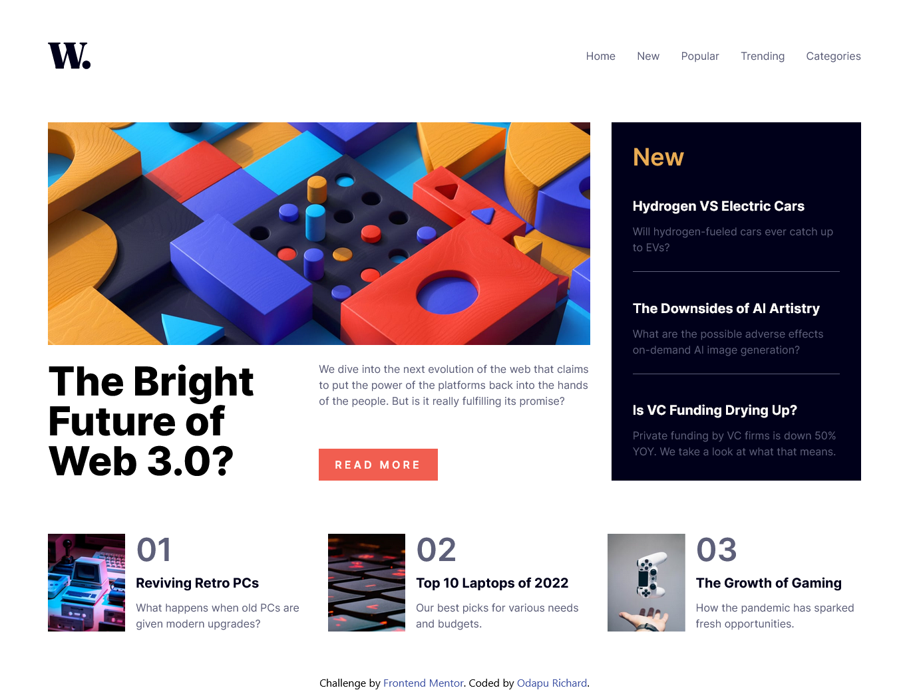

# Frontend Mentor - News homepage solution

This is a solution to the [News homepage challenge on Frontend Mentor](https://www.frontendmentor.io/challenges/news-homepage-H6SWTa1MFl). Frontend Mentor challenges help you improve your coding skills by building realistic projects.

## Table of contents

- [Overview](#overview)
  - [The challenge](#the-challenge)
  - [Screenshot](#screenshot)
  - [Links](#links)
- [My process](#my-process)
  - [Built with](#built-with)
- [Author](#author)
- [Acknowledgments](#acknowledgments)

## Overview

### The challenge

Users should be able to:

- View the optimal layout for the interface depending on their device's screen size
- See hover and focus states for all interactive elements on the page
- **Bonus**: Toggle the mobile menu (requires some JavaScript)

### Screenshot

### Links

- Solution URL: [Solution](https://github.com/11-Ace/news-homepage-main)
- Live Site URL: [Link](https://11-ace.github.io/news-homepage-main/)

## My process

### Built with

- Semantic HTML5 markup
- Tailwind CSS

## Author

- Frontend Mentor - [11-Ace](https://www.frontendmentor.io/profile/11-Ace)
- Twitter - [11Ace\_\_](https://www.twitter.com/@11ace__)
